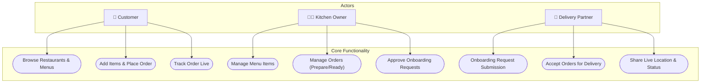
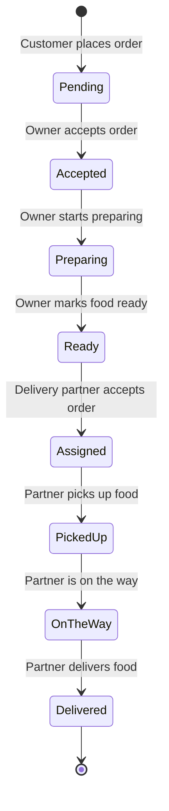
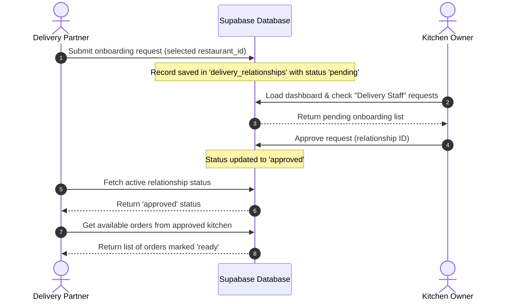

# 📊 Workflows & System Diagrams

This document contains Mermaid diagrams illustrating the primary workflows, actors, and state transitions within the Provender platform.

---

## 1. System Use Case Diagram
This flowchart maps the different actors (Customer, Kitchen Owner, and Delivery Partner) to their key interaction capabilities within the system.

---

## 2. Order Lifecycle Activity Diagram
This state diagram represents the sequence of statuses an order undergoes from the initial customer placement through the kitchen prep and courier delivery.

---

## 3. Delivery Partner Onboarding Sequence Diagram
This sequence diagram shows the message exchanges and database status checks between a delivery partner, the Supabase database/backend, and a kitchen owner during the onboarding phase.

