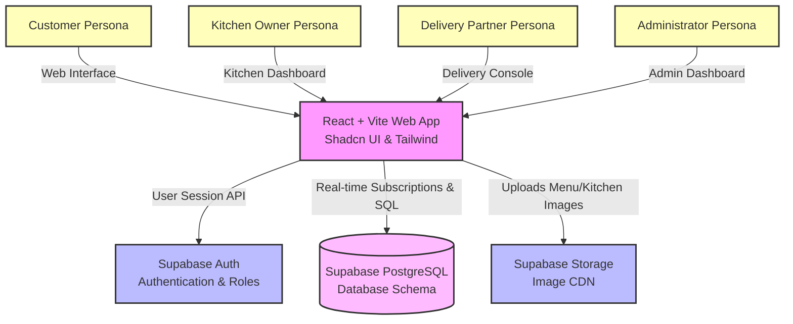
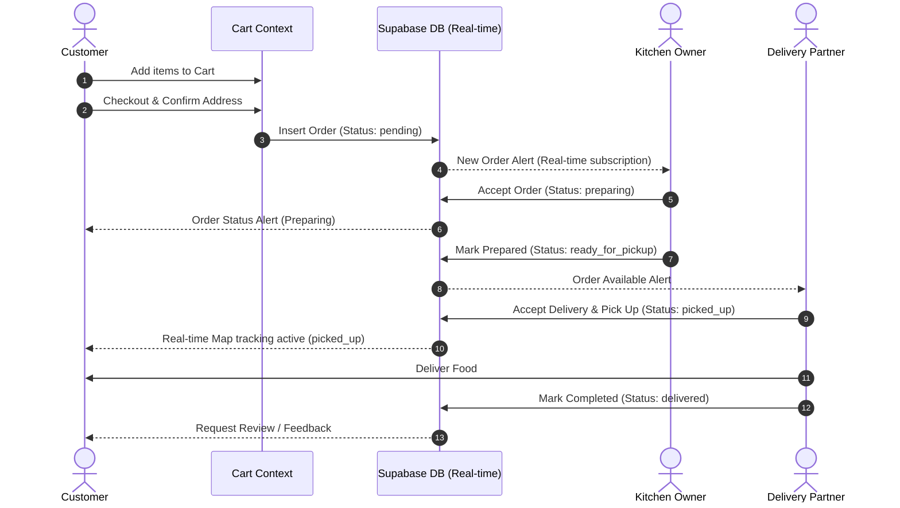
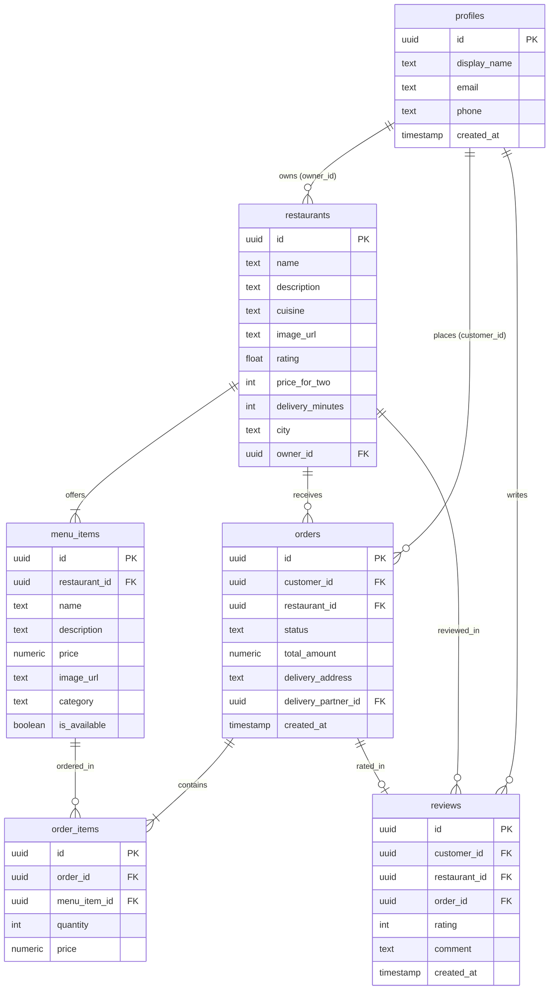

# Proposed Design and Model

This document outlines the proposed design, system architecture, data flow, and database schemas for the **Provender** food delivery application.

---

## 5.1 High Level System Architecture Diagram

This diagram represents the high-level architecture of the Provender system, detailing how various user personas interact with the React web client and how it integrates with Supabase backend services.

### Interactive System Architecture Diagram

### Generated Image
- [View High-Level Architecture Diagram Image](file:///C:/Users/Admin/.gemini/antigravity/brain/10086d21-c3a6-4950-8fba-eaf9fe0938f4/artifacts/high_level_diagram.png)

### Prompt used to generate this image:
> *"A professional and clean high-level software system architecture diagram for a food delivery application. The diagram shows User Roles (Customer, Kitchen Owner, Delivery Partner, Admin) connecting to a React/Vite web client frontend. The frontend connects via APIs to a backend powered by Supabase (Auth, Database, Storage). The design uses a clean white background, clean blue and orange professional block components, clear connection arrows, and crisp, legible technical text. Title: 'Provender System Architecture'."*

---

## 5.2 Low Level Component & Data Flow Diagram

This diagram shows the step-by-step sequential lifecycle of an order inside the Provender application.

### Interactive Order Lifecycle Sequence Diagram

### Generated Image
- [View Low-Level Data Flow Diagram Image](file:///C:/Users/Admin/.gemini/antigravity/brain/10086d21-c3a6-4950-8fba-eaf9fe0938f4/artifacts/low_level_diagram.png)

### Prompt used to generate this image:
> *"A detailed data flow and sequence diagram showing the step-by-step order lifecycle in a food delivery system. Steps shown: 1. Customer places order (cart state to database) -> 2. Kitchen Owner receives order and updates status to preparing -> 3. Delivery Partner accepts order and marks as picked up -> 4. Real-time tracking updates on customer screen. The design is a clean block diagram, professional flow chart style, white background, high contrast blue/teal colors, extremely readable and formal for a college project report."*

---

## 5.3 Database Entity-Relationship (ER) Schema

This diagram represents the physical layout of the database tables and schemas stored in Supabase.

### Schema Relationships

